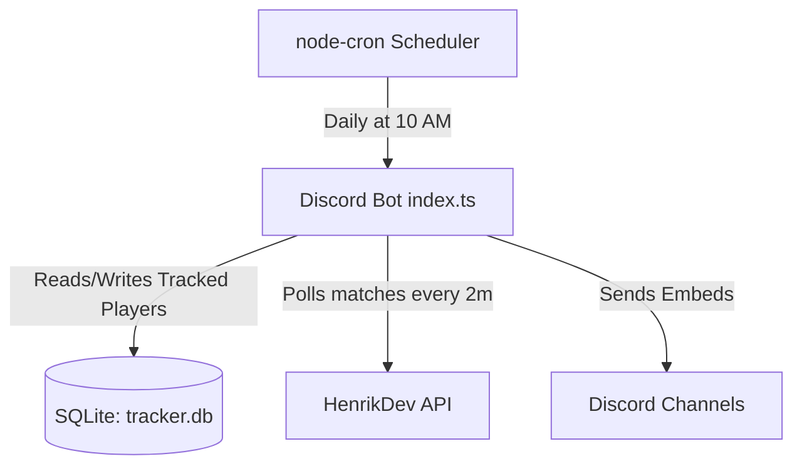

# Technical Implementation Plan - Discord Valorant Tracker Bot

This document outlines the technical specification and roadmap for building the Valorant Tracker Discord Bot.

---

## 1. System Architecture

The tracker is designed as a standalone Node.js script executing on a persistent loop, storing state in an SQLite database. It is intended to run as a PM2 process or Coolify worker service.



---

## 2. Dependencies & Project Setup

The bot runs on TypeScript and requires these NPM modules:
- `discord.js` (Interact with the Discord Gateway)
- `better-sqlite3` (SQLite Database driver)
- `node-cron` (Schedule daily summary execution)
- `dotenv` (Load credentials from `.env`)
- `tsx` & `typescript` (Compile and run TypeScript)

---

## 3. Database Schema

The SQLite database stores tracked accounts and checkpoints:

```sql
CREATE TABLE IF NOT EXISTS tracked_players (
  id INTEGER PRIMARY KEY AUTOINCREMENT,
  name TEXT NOT NULL,
  tag TEXT NOT NULL,
  puuid TEXT NOT NULL,
  channel_id TEXT NOT NULL,
  last_match_id TEXT,
  daily_start_rr INTEGER,
  daily_start_rank TEXT,
  daily_start_date TEXT,
  UNIQUE(name, tag, channel_id)
);
```

- **Checkpoint calculation:**
  - `AbsMMR = (tier_number * 100) + RR`
  - `Delta = CurrentAbsMMR - DailyStartAbsMMR`
  - `tier_number` ranges from `3` (Iron 1) to `27` (Radiant).

---

## 4. API Endpoints Used

### 1. Resolve Account (Check Existence & PUUID)
- **URL:** `GET https://api.henrikdev.xyz/valorant/v1/account/{name}/{tag}`
- **Auth:** Headers: `Authorization: <API_KEY>`

### 2. Match History (Get Latest Game ID & MMR)
- **URL:** `GET https://api.henrikdev.xyz/valorant/v1/mmr-history/eu/{name}/{tag}`

### 3. Match Details (Get Stats, Win/Loss, Map & Score)
- **URL:** `GET https://api.henrikdev.xyz/valorant/v4/matches/eu/pc/{name}/{tag}?size=1`

---

## 5. Main Execution Flow

1. **Bot Start:**
   - Initialize Discord Client and login.
   - Run SQLite migrations.
   - Fetch static assets (agents/maps) from `valorant-api.com` to fetch lookup images.
   - Register `/track`, `/untrack`, and `/list-tracked` slash commands globally.

2. **Interval Loop (Every 2 minutes):**
   - Query all tracked players.
   - Fetch their latest `mmr-history` from HenrikDev API.
   - Compare `match_id` to `last_match_id` in database.
   - If changed, fetch match details, filter for `Competitive` queue, format and post the Discord embed, and update `last_match_id`.

3. **Daily Summary Scheduler (10:00 AM Daily):**
   - Query tracked players grouped by `channel_id`.
   - Calculate absolute MMR delta and pull wins/losses from the past 24 hours.
   - Format a single consolidated "Yesterday's Summary" message for the channel.
   - Update `daily_start_rr`, `daily_start_rank`, and `daily_start_date` to today's stats.
