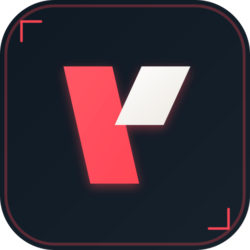

<p align="center">
  
</p>

<h1 align="center">VALTRACK BOT</h1>

<p align="center">
  <strong>Un bot Discord autonome de suivi d'historique de matchs et de statistiques compétitives Valorant.</strong>
</p>

<p align="center">
  
  
  
  
</p>

---

## 🚀 Fonctionnalités Clés

* 🔔 **Alertes instantanées (Match End)** : Envoi automatique de fiches de score détaillées dès qu'un joueur termine une partie compétitive (K/D/A, Agent avec icône, Carte avec splash art, gain/perte de RR précis, et lien vers la fiche web).
* 📊 **Résumé quotidien (Daily Summary)** : Un récapitulatif complet chaque jour à 10h00 des parties de la veille pour tous les joueurs suivis dans le salon (ratio victoires/défaites, différence de RR, historique d'évolution).
* 🛠️ **Commandes Slash intuitives** :
  * `/track [name] [tag] [channel:optionnel]` : Ajoute un joueur à suivre dans le salon spécifié (ou courant).
  * `/untrack [name] [tag]` : Arrête le suivi compétitif d'un joueur.
  * `/list-tracked` : Affiche la liste des joueurs suivis sur le serveur.
* 📦 **Persistance robuste** : Utilise une base SQLite locale (`better-sqlite3`) avec support d'une variable d'environnement pour externaliser le stockage (essentiel sous Docker).
* 🎨 **Intégration d'Assets Dynamiques** : Exploite l'API `valorant-api.com` pour synchroniser les icônes d'agents, les images de cartes et les badges de rang compétitif de manière transparente.

---

## ⚙️ Configuration & Variables d'Environnement

Créez un fichier `.env` à la racine du projet (ou un dossier parent) :

```env
DISCORD_TOKEN=votre_token_bot_discord
DISCORD_CLIENT_ID=votre_client_id_application
VALORANT_API_KEY=votre_henrikdev_api_key (https://docs.henrikdev.xyz/)

# Requis pour Coolify/Docker pour garder les données lors des mises à jour
DATABASE_PATH=/app/data/tracker.db
```

---

## 🛠️ Lancement en Développement

Installez les dépendances et lancez le bot en mode développement :

```bash
# Installation des packages
npm install

# Démarrage avec rechargement automatique (via tsx)
npm run dev
```

---

## 🐳 Déploiement Production (Coolify & Docker)

Ce bot est conçu pour être déployé facilement en tâche de fond sur **Coolify** en tant que **Worker/Service privé** :

1. **Création de la ressource** :
   - Ajoutez une nouvelle application depuis votre dépôt Git.
   - Sélectionnez le sous-dossier contenant le bot si vous l'avez séparé.
2. **Configuration du type de service** :
   - Configurez l'application comme un **Worker** (pas de ports exposés ni de reverse proxy/domaines nécessaires).
3. **Volume Persistant (Crucial pour SQLite)** :
   - Dans l'onglet **Storage** de votre application Coolify, ajoutez un volume :
     `bot-data:/app/data`
   - Définissez la variable d'environnement `DATABASE_PATH=/app/data/tracker.db`.
4. **Déploiement** :
   - Lancez le build. Le `Dockerfile` compilera le code TypeScript et démarrera le démon de manière sécurisée sous Node 22 Alpine.
